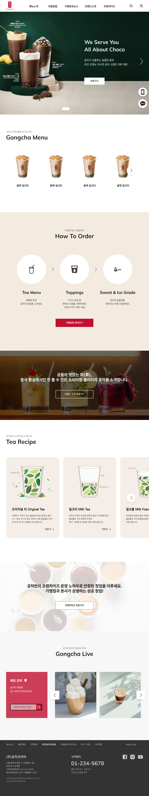
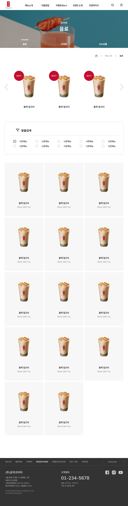
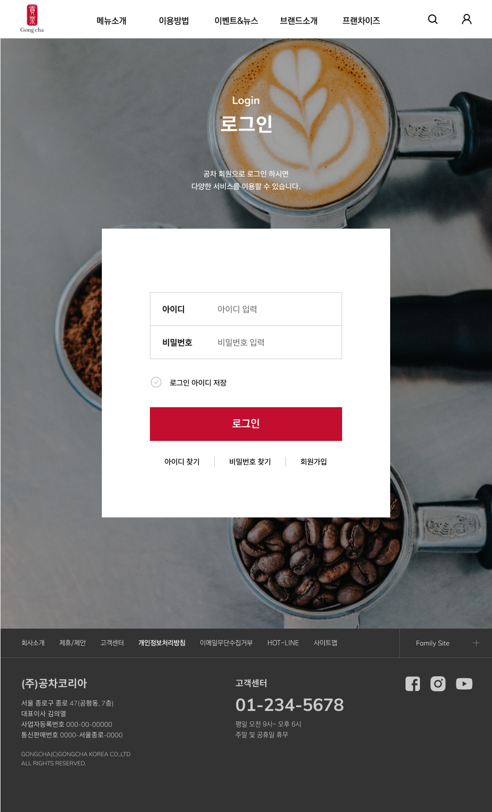
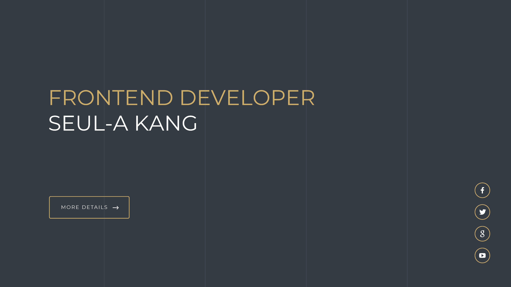

# 공차 Gongcha

음료 브랜드인 [**공차**](https://www.gong-cha.co.kr/brand/)의 기존 웹사이트를 기획부터 디자인, 개발, 배포까지 혼자 진행하며 웹 개발의 전반적인 프로세스를 익혔습니다. 특히 Vanilla JavaScript의 습득을 목표로 하였기 때문에 라이브러리와 플러그인을 최소한으로 제한하고 직접 코딩하도록 했습니다. 시멘틱한 Tag 사용과 웹 표준 마크업에도 중점을 두고, 모든 기기에서 이용할 수 있도록 반응형 웹으로 구현하였습니다.

 
 

## Tech Stack

---

|                                                      HTML                                                       |                                                      CSS                                                       |                                                      JavaScript                                                       |                                                      Github                                                       |
| :-------------------------------------------------------------------------------------------------------------: | :------------------------------------------------------------------------------------------------------------: | :-------------------------------------------------------------------------------------------------------------------: | :---------------------------------------------------------------------------------------------------------------: |
|  |  |  |  |

---

기획 단계에서는 사이트 선정 및 분석, 기획, 웹 프로토타입
스케치, Figma를 이용한 UIUX 디자인 등을 경험했고, 구축
단계에서는 웹 표준에 입각한 시멘틱 마크업, 기기와
브라우저의 특성에 맞는 반응형 적용과 크로스브라우징에
신경을 썼습니다. Github를 이용해 버전 관리를 하였으며
Vercel을 통해 배포하였습니다.

 
 

## Summary

---

<table>
  <th style="text-align: center">메인</th>
  <th style="text-align: center">음료</th>
  <th style="text-align: center">브랜드 소개</th>
  <th style="text-align: center">로그인</th>
  <tr>
    <td style="vertical-align: top">
      
    </td>
    <td style="vertical-align: top">
      <a href="./html/drink.html">  
       </
      </a>
    </td>
    <td style="vertical-align: top">
      
    </td>
    <td style="vertical-align: top">
      
    </td>
    <td></td>
  </tr>
</table>

---

- header와 footer를 컴포넌트화 하여 모든 파일에서 fetching 하도록 구현.
- 브라우저 해상도에 따라 모바일 기기와 PC 여부를 식별하여 해당하는 html, js파일을 불러오도록 구현
- 브라우저 해상도가 변경될 경우 이전 해상도의 html, js를 제거하고 현재 해상도에 해당하는 파일을 불러오도록 구현.
- 각자 디테일이 다른 3종의 슬라이드를 구현.

 
 

## Process

---

진행과정이 디테일하게 담긴 [포트폴리오 PDF](./asset/portfolio.pdf) 입니다.

 
 

## Known Issues

---

메인 페이지의 슬라이드 일부가 해상도 변경 시 혹은 모바일 기기에서 터치 조작 시 원활하게 작동하지 않는 이슈가 있습니다. 각 해상도마다 파일을 분리해 컴포넌트화 하고 해상도 값을 읽어와 상태를 변경해야 했는데 시간 문제상 통합된 파일에서 관리하도록 했기 때문인 것으로 추정됩니다. 추후 개선하려고 합니다.

 
 

## Copyright

---

이 프로젝트는 영리적 목적이 아닌 개인 포트폴리오 용도로 작성되었습니다. 상업적 이득이 전혀 발생하지 않으며, 원 저자의 권리를 침해할 의도가 없음을 명시합니다.
